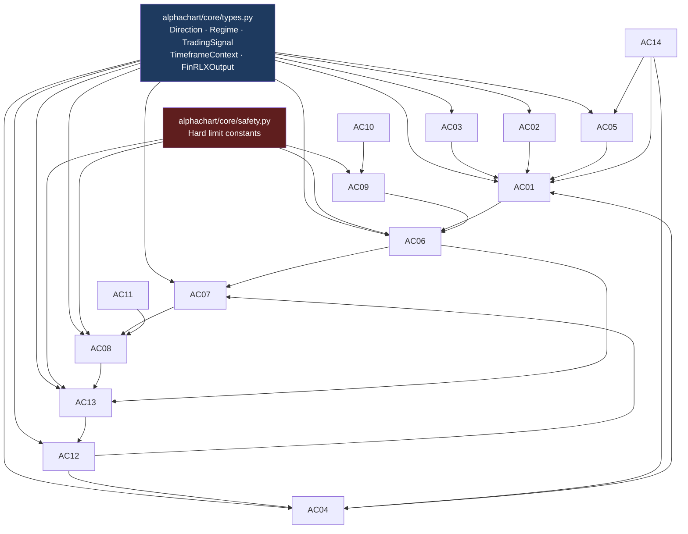

# AlphaChart v3.4 — Master Orchestrator & System Integration Document

**Revision:** v3.4.0-master | **Status:** Canonical Reference | **Classification:** Architecture

---

## Table of Contents

1. [Purpose & Authority](#1-purpose--authority)
2. [System Architecture — Full Diagram](#2-system-architecture--full-diagram)
3. [Module Registry](#3-module-registry)
4. [Data Flow — End-to-End](#4-data-flow--end-to-end)
5. [Integration Contracts — Module-to-Module](#5-integration-contracts--module-to-module)
6. [Shared Data Types & Naming Conventions](#6-shared-data-types--naming-conventions)
7. [Universal Design Principles](#7-universal-design-principles)
8. [Hard Safety Limits — System-Wide Registry](#8-hard-safety-limits--system-wide-registry)
9. [Module Dependency Graph & Initialization Order](#9-module-dependency-graph--initialization-order)
10. [Consistency Enforcement Rules](#10-consistency-enforcement-rules)
11. [Versioning & Document Merging Strategy](#11-versioning--document-merging-strategy)
12. [In-Application Virtual Manual](#12-in-application-virtual-manual)
13. [Implementation Roadmap](#13-implementation-roadmap)
14. [Success Criteria — System Level](#14-success-criteria--system-level)

---

## 1. Purpose & Authority

### 1.1 What This Document Is

This is the **canonical integration reference** for AlphaChart v3.4. It defines how all subsystems work together as a unified whole. Every supplemental design document (`AC_01` through `AC_14`) is subordinate to this document. Where any supplemental document conflicts with this orchestrator, this document takes precedence.

### 1.2 Document Suite

| Document ID | Title | Domain |
|---|---|---|
| **AC_00** | **Master Orchestrator** ← this document | System-wide |
| AC_01 | Core Ensemble & Probabilistic Scoring Engine | Signal generation |
| AC_02 | Multi-Timeframe Analysis & Higher-TF Anchor System | Signal generation |
| AC_03 | Regime Detection & Conditional Weighting Engine | Signal generation |
| AC_04 | FinRL-X Expert Signal Integration | Signal generation |
| AC_05 | ML Factor Model & Feature Engineering | Signal generation |
| AC_06 | Deterministic Safety Layer & Hard Risk Guards | Safety |
| AC_07 | LLM Quality Gate — Senior Quant Reviewer | Quality control |
| AC_08 | Position Sizing, Risk Management & Aggressiveness Mapping | Risk |
| AC_09 | Market-Wide Scanner Mode | Discovery |
| AC_10 | Portfolio Scanner & Live Broker Integration | Execution |
| AC_11 | BIOS-Style GUI & User Configuration System | Interface |
| AC_12 | Learning & Adaptation Engine — RLMF + RAG Memory | Intelligence |
| AC_13 | Order Management, Execution & State Lock | Execution |
| AC_14 | Backtest Audit Protocol, Hygiene Rules & Validation Framework | Validation |

### 1.3 Governing Mission

> **AlphaChart v3.4 trains a self-improving algorithmic system that achieves a minimum 60% paper trade success rate (target: 80–90%+), delivers predictions in a user-friendly way, and at no point endangers capital beyond hard-coded safety limits.**

Every design decision in every supplemental document must serve this mission.

---

## 2. System Architecture — Full Diagram

```mermaid
flowchart TD
    subgraph INTERFACE ["⬛ INTERFACE LAYER (AC_11)"]
        GUI[BIOS-Style GUI\nStreamlit · General + Advanced Mode]
        CFG[ConfigManager\nAggressiveness Index · SpreadConfig]
    end

    subgraph DISCOVERY ["⬛ DISCOVERY LAYER"]
        MWS[Market-Wide Scanner\nAC_09 · Full Universe · ~8,000 tickers]
        PSC[Portfolio Scanner\nAC_10 · Held + Watchlist tickers]
    end

    subgraph DATA ["⬛ DATA LAYER"]
        DFT[DataFetcher\nyfinance · Alpaca · TTL Cache]
        BRK[BrokerConnector\nAlpaca Primary · IBKR Fallback · AC_10]
    end

    subgraph SIGNAL ["⬛ SIGNAL GENERATION PIPELINE"]
        MTA[MultiTimeframeAnalyzer\nAC_02 · 6 timeframes · Anchor bias]
        RGM[RegimeDetector\nAC_03 · 4 regimes · Conditional weights]
        FRL[FinRLX Engine\nAC_04 · PPO agents · Expert signal]
        MLF[MLFactorModel\nAC_05 · GBM · 8 factors]
        ENS[EnsembleAggregator\nAC_01 · Regime-conditional · Conviction score]
    end

    subgraph SAFETY ["⬛ SAFETY LAYER (AC_06)"]
        DSF[DeterministicSafetyFilter\nEarnings · Gap · Liquidity · Halt]
        DDG[DrawdownGuard\nSoft + Hard portfolio halt]
        SLK[StateLock\nPer-ticker concurrent order block]
    end

    subgraph QUALITY ["⬛ QUALITY LAYER (AC_07)"]
        LLM[LLMQualityGate\nSenior Quant · Quality score only\nNO directional vote]
        SQD[SignalQualityDecision\nApprove · Caution · Reject]
    end

    subgraph RISK ["⬛ RISK LAYER (AC_08)"]
        PSZ[PositionSizer\nATR-based · Kelly-scaled · AI-modulated]
        AGG[AggressivenessMapper\nGrowth Target → AI → all thresholds]
    end

    subgraph EXECUTION ["⬛ EXECUTION LAYER (AC_13)"]
        OMG[OrderManager\nLimit orders · Paper broker]
        TRK[TradeTracker\nOpen positions · P&L monitoring]
    end

    subgraph LEARNING ["⬛ LEARNING LAYER (AC_12)"]
        RAG[RAGMemory\nChromaDB · Per-ticker + Cross-ticker]
        RLM[RLMFEngine\nReward shaping · Experience buffer]
        RTC[RetrainingController\nDegradation trigger · FinRL-X retrain]
    end

    subgraph VALIDATION ["⬛ VALIDATION LAYER (AC_14)"]
        PH0[Phase0Auditor\n7-step blocking gate]
        BHR[BacktestHygiene\nWalk-forward · No lookahead · Cost realism]
    end

    %% Interface → Discovery
    GUI --> MWS
    GUI --> PSC
    CFG --> AGG

    %% Discovery → Data
    MWS --> DFT
    PSC --> DFT
    PSC --> BRK

    %% Data → Signal
    DFT --> MTA
    DFT --> RGM
    DFT --> FRL
    DFT --> MLF

    %% Signal → Ensemble
    MTA --> ENS
    RGM --> ENS
    FRL --> ENS
    MLF --> ENS

    %% Ensemble → Safety
    ENS --> DSF

    %% Safety → Quality
    DSF --> LLM
    LLM --> SQD

    %% Risk modulation
    AGG --> PSZ
    AGG --> SQD

    %% Quality → Risk → Execution
    SQD --> PSZ
    PSZ --> DDG
    DDG --> SLK
    SLK --> OMG

    %% Execution → Tracking
    OMG --> TRK

    %% Learning feedback loop
    TRK --> RAG
    TRK --> RLM
    RAG --> LLM
    RAG --> ENS
    RLM --> RTC
    RTC --> FRL

    %% Validation gate
    PH0 -.->|BLOCKING GATE| ENS
    BHR -.->|AUDIT| ENS

    style INTERFACE fill:#1e2a3a,stroke:#4a7a9b
    style DISCOVERY fill:#1e3a2a,stroke:#4a9b7a
    style DATA fill:#2a2a1e,stroke:#9b9b4a
    style SIGNAL fill:#2a1e3a,stroke:#7a4a9b
    style SAFETY fill:#3a1e1e,stroke:#9b4a4a
    style QUALITY fill:#1e3a3a,stroke:#4a9b9b
    style RISK fill:#3a2a1e,stroke:#9b7a4a
    style EXECUTION fill:#1e2a3a,stroke:#4a4a9b
    style LEARNING fill:#2a3a1e,stroke:#7a9b4a
    style VALIDATION fill:#3a1e3a,stroke:#9b4a9b
```



---

## 3. Module Registry

Each module has a canonical ID, owner document, primary class, and a defined set of inputs and outputs.

| Module ID | Name | Primary Class | Inputs | Outputs |
|---|---|---|---|---|
| AC_01 | Ensemble | `EnsembleAggregator` | `FinRLXOutput`, `list[TimeframeContext]`, `Regime`, `ml_score` | `(conviction: float, direction: Direction)` |
| AC_02 | Multi-TF | `MultiTimeframeAnalyzer` | `dict[str, DataFrame]` | `list[TimeframeContext]`, `Direction` (anchor) |
| AC_03 | Regime | `RegimeDetector` | `DataFrame` (daily) | `Regime`, `dict` (weights) |
| AC_04 | FinRL-X | `FinRLXEngine` | `np.ndarray` (state), `Regime` | `FinRLXOutput` |
| AC_05 | ML Factor | `MLFactorModel` | `DataFrame` (daily) | `float` (score 0–1) |
| AC_06 | Safety | `DeterministicSafetyFilter` | `ticker`, `signal_dict`, `DataFrame` | `(bool, list[str])` |
| AC_07 | LLM Gate | `LLMQualityGate` | Full signal dossier | `dict` (quality result) |
| AC_08 | Risk/Size | `PositionSizer`, `AggressivenessMapper` | `entry`, `stop`, `conviction`, `config` | `dict` (sizing) |
| AC_09 | Scanner | `MarketWideScanner` | `SpreadConfig`, universe | `list[ScanResult]` |
| AC_10 | Portfolio | `PortfolioScanner`, `AlpacaConnector` | broker config | `list[str]` (tickers) |
| AC_11 | GUI | Streamlit app | user input | `config dict` |
| AC_12 | Learning | `RAGMemoryStore`, `RLMFEngine` | `TradingSignal`, `outcome` | RAG context, reward |
| AC_13 | Orders | `OrderManager` | `TradingSignal`, `sizing` | order result |
| AC_14 | Backtest | `Phase0Auditor` | model, data | pass/fail + report |

---

## 4. Data Flow — End-to-End

### 4.1 Primary Signal Path (Portfolio Scanner)

```
[AC_11 GUI] → user triggers scan
    │
    ▼
[AC_10 PortfolioScanner] → get_scan_universe()
    → tickers = held_positions ∪ watchlist
    │
    ▼
[DataFetcher] → fetch OHLCV for each ticker
    → 7 timeframes: 3mo, 1mo, 2wk, 1wk, daily, 60m, 15m
    → cache with per-TF TTL
    │
    ▼ per ticker:
    ├── [AC_02 MultiTimeframeAnalyzer] → list[TimeframeContext] + anchor_bias
    ├── [AC_03 RegimeDetector] → Regime + regime_weights
    ├── [AC_04 FinRLXEngine] → FinRLXOutput
    └── [AC_05 MLFactorModel] → ml_factor_score
    │
    ▼
[AC_01 EnsembleAggregator]
    → aggregate(frl_out, contexts, regime, ml_score, weights, anchor_bias)
    → returns: (conviction_score, direction)
    │
    ▼
[AC_06 DeterministicSafetyFilter]
    → check(ticker, signal, df_daily)
    → if blocked: log → discard
    → if passed: continue
    │
    ▼
[AC_12 RAGMemory] → retrieve_context(ticker, regime, direction)
    → returns: rag_context string
    │
    ▼
[AC_07 LLMQualityGate]
    → evaluate(full_dossier)
    → returns: {quality_score, risk_flags, narrative, recommendation}
    │
    ▼
[AC_07 SignalQualityDecision]
    → decide(llm_result, conviction_score, config)
    → if REJECT: discard
    → if APPROVE: continue
    │
    ▼
[AC_08 PositionSizer]
    → compute(ticker, entry, stop, conviction, config)
    → returns: {shares, risk_amount, stop_loss, profit_target}
    │
    ▼
[AC_06 DrawdownGuard] → update_and_check()
    → if HALT: block all new orders
    │
    ▼
[AC_13 OrderManager]
    → execute_signal(TradingSignal, sizing)
    → StateLock check
    → submit limit order to broker (AC_10)
    │
    ▼
[AC_11 GUI] → display in Signals tab
[AC_12 RAGMemory + RLMFEngine] → record outcome on close
```

### 4.2 Market-Wide Scanner Path

```
[AC_11 GUI] → user triggers scanner
    │
    ▼
[AC_09 MarketWideScanner]
    Stage 1: UniverseBuilder → ~8,000 tickers
    Stage 2: Metadata filter → ~3,000
    Stage 3: VectorizedScreener (bulk daily fetch) → ~600
    Stage 4: Multi-TF fetch (20-thread) → 600 scored
    Stage 5: EnsembleAggregator (same as primary path)
    Stage 6: DeterministicSafetyFilter (same as primary path)
    Stage 7: LLMQualityGate (batched, 10/call)
    Stage 8: ResultRanker + ClusterDeduplicator
    │
    ▼
[AC_11 GUI] → Results table with Approve/Watchlist/Export actions
    → Approved results re-enter primary path at [AC_13 OrderManager]
```

### 4.3 Learning Feedback Path

```
[AC_13 OrderManager] → trade opened
    │
    ▼ (on close)
[AC_13 TradeTracker] → record outcome {pnl_pct, won, exit_reason}
    │
    ├── [AC_12 RAGMemory] → record_outcome(signal, outcome)
    │       → per-ticker and cross-ticker pattern storage
    │
    ├── [AC_12 RLMFEngine] → compute_reward → record_experience
    │
    └── [AC_12 RetrainingController] → should_retrain()?
            → if YES: FinRLXEngine.retrain(regime, data)
                      MLFactorModel.retrain(data)
```

---

## 5. Integration Contracts — Module-to-Module

Each contract defines what one module promises to produce and what the downstream module requires.

### 5.1 AC_02 → AC_01 (Multi-TF → Ensemble)

```python
# AC_02 PRODUCES:
contexts:    list[TimeframeContext]   # one per available timeframe
anchor_bias: Direction                # weighted consensus of 3mo, 1mo, 1wk

# AC_01 REQUIRES:
# - len(contexts) >= 1
# - anchor_bias is a valid Direction enum value
# - each TimeframeContext has: timeframe, trend_direction, trend_strength,
#   momentum_score, confidence (all within documented ranges)
```

### 5.2 AC_03 → AC_01 (Regime → Ensemble)

```python
# AC_03 PRODUCES:
regime:          Regime                    # one of 4 enum values
regime_weights:  dict[str, float]         # keys: finrl_x, multi_tf, ml_factor, regime_score
                                           # values: sum to 1.0 (normalized)

# AC_01 REQUIRES:
# - regime is a valid Regime enum value
# - sum(regime_weights.values()) ≈ 1.0 (tolerance 0.001)
```

### 5.3 AC_04 → AC_01 (FinRL-X → Ensemble)

```python
# AC_04 PRODUCES:
FinRLXOutput(
    agent_id:          str,
    action_probs:      dict,   # keys: BUY, HOLD, SELL; values sum to ~1.0
    q_value:           float,  # [0.0, 1.0]
    agent_confidence:  float,  # [0.0, 1.0]
    regime_trained_on: Regime
)

# AC_01 REQUIRES:
# - action_probs contains BUY, SELL, HOLD keys
# - sum(action_probs.values()) ≈ 1.0
# - agent_confidence in [0.0, 1.0]
```

### 5.4 AC_01 → AC_06 (Ensemble → Safety)

```python
# AC_01 PRODUCES:
conviction_score: float      # [0.0, 1.0]
direction:        Direction  # LONG | SHORT | FLAT

# AC_06 REQUIRES:
# - conviction_score in [0.0, 1.0]
# - direction is a valid Direction enum
# - df_daily with at minimum 30 bars of OHLCV
```

### 5.5 AC_06 → AC_07 (Safety → LLM)

```python
# AC_06 PRODUCES:
passed:        bool
block_reasons: list[str]     # empty if passed=True

# AC_07 REQUIRES:
# - Only receives signals where passed=True
# - Never receives blocked signals
# - Full dossier: ticker, direction, conviction, contexts, frl_out,
#   ml_score, regime, rag_context, pre_flags
```

### 5.6 AC_07 → AC_08 (LLM → Sizer)

```python
# AC_07 PRODUCES:
{
    "quality_score":         float,    # [0.0, 1.0]
    "recommendation":        str,      # "APPROVE" | "APPROVE_WITH_CAUTION" | "REJECT"
    "risk_flags":            list[str],
    "key_strengths":         list[str],
    "key_weaknesses":        list[str],
    "narrative":             str,
    "confidence_in_quality": float,
}

# AC_08 REQUIRES:
# - Only receives signals where recommendation != "REJECT"
# - quality_score >= config["min_quality_score"]
# - conviction_score >= config["conviction_threshold"]
```

### 5.7 AC_08 → AC_13 (Sizer → OrderManager)

```python
# AC_08 PRODUCES:
{
    "shares":          int,
    "position_value":  float,
    "risk_amount":     float,
    "stop_loss":       float,
    "profit_target":   float,
    "stop_pct":        float,
    "rr_ratio":        float,
}

# AC_13 REQUIRES:
# - shares >= 1
# - stop_loss price is valid (not None, not zero)
# - profit_target > entry (LONG) or profit_target < entry (SHORT)
```

### 5.8 AC_13 → AC_12 (OrderManager → Learning)

```python
# AC_13 PRODUCES on trade close:
outcome = {
    "pnl_pct":                   float,
    "won":                        bool,
    "hold_duration_days":         int,
    "exit_reason":                str,    # PROFIT_TARGET | STOP_LOSS | TIME_EXIT
    "actual_regime_at_exit":      str,
}

# AC_12 REQUIRES:
# - outcome has all keys above
# - original TradingSignal object reference
```

### 5.9 AC_11 → ALL (Config → Modules)

```python
# AC_11 PRODUCES (via ConfigManager):
config = {
    # From Aggressiveness Index (AI):
    "conviction_threshold":    float,
    "min_quality_score":       float,
    "position_size_pct":       float,
    "stop_loss_atr_mult":      float,
    "profit_target_rr":        float,
    "max_concurrent_trades":   int,
    # From General Mode sliders:
    "max_drawdown_tolerance":  float,
    "max_single_trade_risk":   float,
    "auto_trade":              bool,
    "scan_interval":           int,
    # Computed:
    "active_ai":               float,   # Aggressiveness Index [0.0, 1.0]
}

# ALL modules that receive config MUST:
# - Never modify config in place
# - Never relax hard limits using config values
# - Treat config as read-only input
```

---

## 6. Shared Data Types & Naming Conventions

### 6.1 Canonical Enumerations

```python
# alphachart/core/types.py — THE canonical type definitions
# All modules import from this file. Never redefine locally.

from enum import Enum

class Direction(Enum):
    LONG  = "LONG"
    SHORT = "SHORT"
    FLAT  = "FLAT"

class Regime(Enum):
    TRENDING_UP   = "TRENDING_UP"
    TRENDING_DOWN = "TRENDING_DOWN"
    RANGING       = "RANGING"
    VOLATILE      = "VOLATILE"

class ExitReason(Enum):
    PROFIT_TARGET      = "PROFIT_TARGET"
    STOP_LOSS          = "STOP_LOSS"
    TIME_EXIT_POSITIVE = "TIME_EXIT_POSITIVE"
    TIME_EXIT_NEGATIVE = "TIME_EXIT_NEGATIVE"
    MANUAL             = "MANUAL"
    EMERGENCY_STOP     = "EMERGENCY_STOP"

class SignalSource(Enum):
    PORTFOLIO_SCANNER  = "PORTFOLIO_SCANNER"
    MARKET_SCANNER     = "MARKET_SCANNER"
    MANUAL             = "MANUAL"
```

### 6.2 Canonical Dataclasses

```python
# alphachart/core/types.py (continued)

from dataclasses import dataclass, field
from typing import Optional

@dataclass
class TimeframeContext:
    timeframe:        str        # "3mo" | "1mo" | "2wk" | "1wk" | "daily" | "60m" | "15m"
    trend_direction:  Direction
    trend_strength:   float      # [0.0, 1.0] — ADX-based
    key_levels:       list[float]
    momentum_score:   float      # [-1.0, +1.0] — MACD/ATR normalized
    structure_intact: bool
    confidence:       float      # [0.0, 1.0] — decays at higher TFs

@dataclass
class FinRLXOutput:
    agent_id:          str
    action_probs:      dict       # {"BUY": float, "HOLD": float, "SELL": float}
    q_value:           float      # [0.0, 1.0]
    agent_confidence:  float      # [0.0, 1.0]
    regime_trained_on: Regime

@dataclass
class TradingSignal:
    ticker:               str
    direction:            Direction
    timeframe:            str
    conviction_score:     float       # [0.0, 1.0] from ensemble
    quality_score:        float       # [0.0, 1.0] from LLM gate
    regime:               Regime
    position_size_pct:    float       # [0.0, HARD_MAX_RISK_PCT]
    stop_loss_price:      float
    profit_target_price:  float
    entry_price:          float
    risk_flags:           list[str]
    narrative:            str
    timeframe_contexts:   list[TimeframeContext]
    finrl_x_outputs:      list[FinRLXOutput]
    source:               SignalSource = SignalSource.PORTFOLIO_SCANNER
    approved:             bool = False
    order_id:             Optional[str] = None
    timestamp:            str = ""
    scan_sai:             float = 0.0   # SAI active at scan time (scanner signals only)
```

### 6.3 Naming Conventions

| Category | Convention | Example |
|---|---|---|
| Class names | PascalCase | `EnsembleAggregator`, `LLMQualityGate` |
| Function names | snake_case | `compute_conviction_score()` |
| Constants | SCREAMING_SNAKE | `HARD_MAX_RISK_PCT` |
| Config keys | snake_case strings | `"conviction_threshold"` |
| File names | snake_case | `ensemble_aggregator.py` |
| Module prefixes | `ac_NN_` for packages | `ac_01_ensemble/` |
| Score variables | `_score` suffix | `conviction_score`, `quality_score` |
| Boolean flags | `is_` or `has_` prefix | `is_approved`, `has_data` |

### 6.4 Score Range Standards

All score variables in AlphaChart use these canonical ranges:

| Variable | Range | Notes |
|---|---|---|
| `conviction_score` | [0.0, 1.0] | From ensemble aggregator |
| `quality_score` | [0.0, 1.0] | From LLM gate |
| `ml_factor_score` | [0.0, 1.0] | Probability of positive return |
| `trend_strength` | [0.0, 1.0] | ADX-based, normalized |
| `momentum_score` | [-1.0, +1.0] | Bidirectional |
| `agent_confidence` | [0.0, 1.0] | max(probs) - min(probs) |
| `aggressiveness_index` | [0.0, 1.0] | From growth target slider |

---

## 7. Universal Design Principles

These principles are binding on every module. Each supplemental document must cite these principles in its Design Philosophy section.

```
PRINCIPLE 1 — NUMERICAL PIPELINE OWNS DIRECTION
  The ensemble (AC_01) makes all directional decisions.
  The LLM (AC_07) evaluates quality only — never direction.
  No module may override a direction set by the ensemble based on narrative logic.

PRINCIPLE 2 — HARD LIMITS ARE IMMUTABLE CODE CONSTANTS
  All HARD_* constants are defined in alphachart/core/safety.py.
  They are never stored in config files, databases, or user settings.
  No runtime path, slider, or API call can modify them.
  See Section 8 for the full registry.

PRINCIPLE 3 — PHASE 0 IS THE UNCONDITIONAL GATE
  No model proceeds to paper trading without passing the 7-step Phase 0 audit (AC_14).
  No exception exists. No bypass exists. No timeout overrides this gate.

PRINCIPLE 4 — ISOLATION: ONE TICKER NEVER BLOCKS ANOTHER
  All per-ticker operations are wrapped in try/except.
  A failure on NVDA never prevents AAPL from being processed.
  Errors are logged; they never propagate upward to block the pipeline.

PRINCIPLE 5 — CHEAP LAYERS FIRST
  Every pipeline applies the cheapest filter first.
  Order: static metadata → vectorized technical → ensemble → safety → LLM.
  Expensive operations (LLM, FinRL-X) only run on candidates that cleared
  all cheaper filters.

PRINCIPLE 6 — AUDITABILITY OVER PERFORMANCE
  Every signal has a complete, reproducible audit trail.
  Every rejection has a documented reason code.
  Every trade outcome is recorded and linked to the originating signal.

PRINCIPLE 7 — STATE-LOCK PREVENTS RACE CONDITIONS
  No two concurrent operations may act on the same ticker simultaneously.
  StateLock (AC_13) is the single authority for per-ticker locking.
  Any module that stages an order must acquire and release the lock.

PRINCIPLE 8 — LLM FAILURES DEFAULT TO REJECTION
  Any LLM timeout, parse failure, or exception results in automatic signal rejection.
  There is no fallback approval path.
  This is non-negotiable (see SNC constraints in AC_07).

PRINCIPLE 9 — RSI IS NEVER A SOLE SIGNAL
  RSI may only appear as one factor among multiple factors.
  Any signal whose conviction derives primarily from RSI alone is blocked
  by the DeterministicSafetyFilter (AC_06).

PRINCIPLE 10 — TRENDING_DOWN DEMANDS ADDITIONAL SCRUTINY
  All LONG signals generated during a TRENDING_DOWN regime receive
  an automatic conviction penalty and quality floor raise.
  Short signals in TRENDING_DOWN may receive a small boost.
  See AC_03 and AC_06 for exact parameters.
```

---

## 8. Hard Safety Limits — System-Wide Registry

Defined in `alphachart/core/safety.py`. **These values are immutable.**

```python
# alphachart/core/safety.py
# DO NOT IMPORT THIS FILE AND MODIFY VALUES AT RUNTIME.
# These are read-only system constants.

# ═══ POSITION-LEVEL LIMITS ═══════════════════════════════════════════════════
HARD_MAX_RISK_PCT              = 0.05    # 5% of portfolio per trade — absolute ceiling
HARD_MIN_STOP_LOSS_ATR_MULT    = 1.0    # stop must be ≥ 1 ATR from entry
HARD_MIN_RR_RATIO              = 1.0    # minimum risk:reward ratio

# ═══ PORTFOLIO-LEVEL LIMITS ══════════════════════════════════════════════════
HARD_MAX_PORTFOLIO_DRAWDOWN    = 0.20   # 20% → full system halt
HARD_MAX_CONCURRENT_TRADES     = 15    # absolute cap on open positions
HARD_MAX_SECTOR_CONCENTRATION  = 0.40  # no sector > 40% of portfolio

# ═══ SIGNAL QUALITY LIMITS ═══════════════════════════════════════════════════
HARD_MIN_CONVICTION_FLOOR      = 0.50  # no signal below 50% conviction ever approved
HARD_MIN_QUALITY_FLOOR         = 0.50  # no signal below 50% LLM quality ever approved

# ═══ TRADING ENVIRONMENT LIMITS ══════════════════════════════════════════════
HARD_MIN_LIQUIDITY_VOLUME      = 500_000   # min avg daily volume for any signal
HARD_EARNINGS_BLACKOUT_DAYS    = 2         # no entries within ±2 days of earnings
HARD_MAX_GAP_PCT               = 0.03      # no entries after >3% overnight gap
HARD_MARKET_OPEN_BLACKOUT_MIN  = 15        # no entries in first 15 min after open

# ═══ ORDER EXECUTION LIMITS ══════════════════════════════════════════════════
HARD_ORDER_TYPE                = "limit"   # all orders are limit orders
HARD_AUTO_APPROVE_MAX_N        = 10        # auto-approve cap (scanner)

# ═══ TREND_DOWN REMEDIATION (v3.3 → v3.4) ═══════════════════════════════════
TREND_DOWN_LONG_CONVICTION_PENALTY  = 0.30   # multiply conviction by 0.70
TREND_DOWN_LONG_QUALITY_FLOOR_RAISE = 0.10   # raise min quality by 10pp
TREND_DOWN_SHORT_CONVICTION_BOOST   = 0.10   # multiply conviction by 1.10
TREND_DOWN_MAX_LONG_POSITION_PCT    = 0.02   # cap LONG positions at 2%

def validate_hard_limits(config: dict) -> None:
    """
    Asserts that a runtime config dict does not violate any hard limit.
    Call this at config load time and after any config modification.
    Raises AssertionError with specific message on violation.
    """
    assert config.get("position_size_pct", 0) <= HARD_MAX_RISK_PCT, \
        f"position_size_pct {config['position_size_pct']} > HARD_MAX_RISK_PCT {HARD_MAX_RISK_PCT}"
    assert config.get("max_portfolio_drawdown", 0) <= HARD_MAX_PORTFOLIO_DRAWDOWN, \
        f"max_portfolio_drawdown exceeds hard limit"
    assert config.get("max_concurrent_trades", 0) <= HARD_MAX_CONCURRENT_TRADES, \
        f"max_concurrent_trades exceeds hard limit"
    assert config.get("min_conviction_score", 1.0) >= HARD_MIN_CONVICTION_FLOOR, \
        f"min_conviction_score below hard floor"
    assert config.get("min_quality_score", 1.0) >= HARD_MIN_QUALITY_FLOOR, \
        f"min_quality_score below hard floor"
```

---

## 9. Module Dependency Graph & Initialization Order

### 9.1 Dependency Graph



### 9.2 Startup Initialization Order

```python
# alphachart/app.py — startup sequence

def initialize_system(config: dict) -> dict:
    """
    Initializes all modules in dependency order.
    Returns a registry of live module instances.
    """
    from alphachart.core import safety
    safety.validate_hard_limits(config)     # MUST be first

    # Layer 1: Core types and data infrastructure
    data_fetcher = DataFetcher()
    broker       = AlpacaConnector(**config["alpaca"]) if not _is_ibkr(config) \
                   else IBKRConnector(**config["ibkr"])
    rag_memory   = RAGMemoryStore(config["rag_path"])
    audit_logger = ScanAuditLogger()

    # Layer 2: Signal generation engines
    regime_detector     = RegimeDetector()
    mta                 = MultiTimeframeAnalyzer()
    finrl_x_engine      = FinRLXEngine(config["agent_checkpoints"])
    ml_factor_model     = MLFactorModel(config["ml_model_path"])
    ensemble_aggregator = EnsembleAggregator()

    # Layer 3: Safety and quality
    safety_filter   = DeterministicSafetyFilter(config["earnings_calendar"])
    llm_gate        = LLMQualityGate(config.get("llm_model", "claude-sonnet-4-6"))
    drawdown_guard  = DrawdownGuard(broker, config)
    state_lock      = {}

    # Layer 4: Risk
    position_sizer = PositionSizer(broker, safety.HARD_LIMITS)
    agg_mapper     = AggressivenessMapper()
    live_config    = agg_mapper.apply(config["aggressiveness_index"], config)

    # Layer 5: Execution
    order_manager  = OrderManager(broker, drawdown_guard, state_lock)
    trade_tracker  = TradeTracker()

    # Layer 6: Learning
    rlmf_engine    = RLMFEngine(config.get("rlmf_reward_scale", 1.0))
    retrain_ctrl   = RetrainingController(finrl_x_engine, ml_factor_model, config)

    # Layer 7: Discovery
    portfolio_scanner = PortfolioScanner(broker, config.get("watchlist", []),
                                         config.get("scan_interval", 15))
    universe_builder  = UniverseBuilder(broker, config.get("watchlist", []))
    market_scanner    = MarketWideScanner(
        universe_builder, VectorizedScreener(), ParallelBatchFetcher(data_fetcher),
        mta, regime_detector, finrl_x_engine, ml_factor_model, ensemble_aggregator,
        safety_filter, llm_gate, position_sizer, PatternDetector(), rag_memory,
        audit_logger, live_config
    )

    # Layer 8: Phase 0 validation (blocks if not passed)
    phase0 = Phase0Auditor(config)
    assert phase0.is_cleared(), "Phase 0 audit not passed — system halted."

    return {
        "data_fetcher":       data_fetcher,
        "broker":             broker,
        "rag_memory":         rag_memory,
        "regime_detector":    regime_detector,
        "mta":                mta,
        "finrl_x_engine":     finrl_x_engine,
        "ml_factor_model":    ml_factor_model,
        "ensemble":           ensemble_aggregator,
        "safety_filter":      safety_filter,
        "llm_gate":           llm_gate,
        "drawdown_guard":     drawdown_guard,
        "state_lock":         state_lock,
        "position_sizer":     position_sizer,
        "order_manager":      order_manager,
        "trade_tracker":      trade_tracker,
        "rlmf_engine":        rlmf_engine,
        "retrain_ctrl":       retrain_ctrl,
        "portfolio_scanner":  portfolio_scanner,
        "market_scanner":     market_scanner,
        "phase0_auditor":     phase0,
        "config":             live_config,
    }
```

---

## 10. Consistency Enforcement Rules

### 10.1 SpreadConfig Consistency

The `SpreadConfig` object (AC_09) and the operational `config` dict (AC_11) must never contradict each other. When the Market-Wide Scanner produces a result that is approved and queued to `OrderManager`, the following parameters must match:

```python
# When scanner result is approved, these values are taken from the LIVE config
# (not from the SpreadConfig used during scanning):
approved_signal.position_size_pct = live_config["position_size_pct"]  # not from scan
approved_signal.stop_loss_atr_mult = live_config["stop_loss_atr_mult"] # not from scan

# The SpreadConfig only governs what ENTERS the results table.
# The live config governs what EXECUTES.
# This prevents a stale scan config from driving execution risk.
```

### 10.2 LLM Quality Gate Consistency

The LLM quality gate must behave identically whether called from:
- `PortfolioScanner` (AC_10) → `LLMQualityGate.evaluate()` (per signal)
- `MarketWideScanner` (AC_09) → `BatchedLLMGate.evaluate_batch()` (10 per call)

Both paths use the same `SYSTEM_PROMPT`, same output schema, and same `SignalQualityDecision` logic. The batch version is a performance optimization only — not a different evaluation standard.

### 10.3 Hard Limit Application Points

Hard limits must be enforced at **all three** of these points — not just one:

```python
# Point 1: Config load time
safety.validate_hard_limits(config)

# Point 2: Position sizing
position_size_pct = min(computed_size, safety.HARD_MAX_RISK_PCT)
assert position_size_pct <= safety.HARD_MAX_RISK_PCT

# Point 3: Order submission
if sizing["position_value"] / equity > safety.HARD_MAX_RISK_PCT:
    raise HardLimitViolation("Position exceeds hard max risk")
```

### 10.4 Regime Enum Consistency

The `Regime` enum is defined once in `alphachart/core/types.py`. Any code that branches on regime values must handle **all four** values:

```python
# CORRECT — handles all regimes explicitly
match regime:
    case Regime.TRENDING_UP:   ...
    case Regime.TRENDING_DOWN: ...
    case Regime.RANGING:       ...
    case Regime.VOLATILE:      ...

# INCORRECT — implicit fallthrough for unknown regimes
if regime == Regime.TRENDING_UP:
    ...
else:
    ...  # silent bug if new regime added
```

---

## 11. Versioning & Document Merging Strategy

### 11.1 Version Schema

```
AlphaChart v{MAJOR}.{MINOR}.{PATCH}-{MODULE}

Examples:
  v3.4.0-master       — Master orchestrator, initial release
  v3.4.1-scanner      — Scanner mode supplemental, revision 1
  v3.4.2-ensemble     — Ensemble engine supplemental, revision 2

MAJOR: Breaking architectural changes (rare)
MINOR: New feature module or significant redesign
PATCH: Bug fixes, clarifications, parameter adjustments
MODULE: Which supplemental document or "master"
```

### 11.2 Merging Protocol

When a supplemental document is updated and must be merged back into the canonical reference:

```
Step 1 — Diff review:
  Compare changed sections to Master Orchestrator integration contracts.
  Flag any contract changes for review.

Step 2 — Hard limit audit:
  Verify no supplemental change relaxes or removes a hard limit.
  Any hard limit change requires explicit sign-off and updates to AC_00 Section 8.

Step 3 — Consistency check:
  Run consistency_checker.py:
    - Verifies all modules import types from alphachart/core/types.py
    - Verifies all HARD_* references point to alphachart/core/safety.py
    - Verifies integration contracts are mutually satisfiable

Step 4 — Update version strings:
  Update the document header REVISION field.
  Add a changelog entry in the document footer.

Step 5 — Re-validate Phase 0:
  If any signal generation module changed, Phase 0 must be re-run
  before the updated model can be used for paper trading.
```

### 11.3 Document Ownership

| Document | Change Authority | Review Required |
|---|---|---|
| AC_00 Master | Architect only | Full team review |
| AC_06 Safety | Architect only | Full team review |
| AC_14 Backtest | Architect only | Full team review |
| AC_01–05 (Signal) | Dev with architect review | Peer review |
| AC_07–08 (Quality/Risk) | Dev with architect review | Peer review |
| AC_09–13 (Infra/UI) | Dev | Self-review + test |

---

## 12. In-Application Virtual Manual

### 12.1 Purpose

The Virtual Manual is an in-application help system and searchable knowledge base embedded in the AlphaChart Streamlit GUI. It converts the design document suite into user-facing documentation, indexed and searchable without leaving the application.

### 12.2 Architecture

```python
class VirtualManual:
    """
    Loads all design documents, chunks them, embeds them in ChromaDB
    (separate collection from trading memory), and exposes a search API
    for the GUI help panel.
    """

    DOCS_PATH = Path("./docs/")
    MANUAL_COLLECTION = "alphachart_manual"

    def __init__(self, rag_client):
        self.collection = rag_client.get_or_create_collection(
            self.MANUAL_COLLECTION
        )

    def index_documents(self):
        """Run once at startup to index all design documents."""
        for doc_path in self.DOCS_PATH.glob("AC_*.md"):
            chunks = self._chunk_document(doc_path)
            for i, chunk in enumerate(chunks):
                self.collection.add(
                    documents=[chunk["text"]],
                    metadatas=[{"source": doc_path.name,
                                "section": chunk["section"],
                                "module": chunk["module"]}],
                    ids=[f"{doc_path.stem}_chunk_{i}"]
                )

    def search(self, query: str, n_results: int = 5) -> list[dict]:
        results = self.collection.query(
            query_texts=[query], n_results=n_results
        )
        return [
            {"text": doc, "source": meta["source"],
             "section": meta["section"]}
            for doc, meta in zip(
                results["documents"][0], results["metadatas"][0]
            )
        ]

    def _chunk_document(self, path: Path,
                        max_chunk_tokens: int = 400) -> list[dict]:
        """Chunks a markdown document by section headers."""
        text = path.read_text()
        sections = re.split(r'\n#{1,3} ', text)
        module = path.stem.replace("AC_", "Module ")
        return [
            {"text": s[:max_chunk_tokens * 4],
             "section": s[:60].strip(),
             "module": module}
            for s in sections if len(s.strip()) > 50
        ]
```

### 12.3 GUI Integration

```python
# In the main Streamlit app — Help Panel
def render_help_panel(manual: VirtualManual):
    st.sidebar.markdown("---")
    st.sidebar.markdown("### 📚 Help")
    query = st.sidebar.text_input(
        "Search documentation...",
        placeholder="e.g., 'how does regime detection work'",
        label_visibility="collapsed"
    )
    if query:
        results = manual.search(query)
        for r in results:
            with st.sidebar.expander(f"📄 {r['section'][:40]}"):
                st.write(r["text"])
                st.caption(f"Source: {r['source']}")
```

### 12.4 Help Content Categories

| Category | Source Documents | Key Topics |
|---|---|---|
| Getting Started | AC_11, AC_00 | First scan, growth target, paper trading setup |
| How Signals Work | AC_01, AC_02, AC_03 | Ensemble, timeframes, regimes |
| Understanding Risk | AC_06, AC_08 | Safety limits, position sizing, drawdown |
| Scanner Guide | AC_09 | Universe, spread slider, presets |
| Learning System | AC_12 | Memory, continuous improvement |
| Advanced Settings | AC_04, AC_05, AC_07 | FinRL-X, factor model, LLM gate |
| Troubleshooting | AC_06, AC_13, AC_14 | Blocks, halts, backtest failures |

---

## 13. Implementation Roadmap

### Phase 0 — Foundation (Weeks 1–3)
**Gate: All hard limits validate. Core types compile. DataFetcher tested.**

| Task | Module | Test |
|---|---|---|
| Implement `alphachart/core/types.py` | All | Type instantiation tests |
| Implement `alphachart/core/safety.py` | AC_06 | `validate_hard_limits()` assertion tests |
| Implement `DataFetcher` with TTL cache | AC_02 | Fetch 10 tickers, 7 TFs, verify cache hit |
| Phase 0 Auditor stub | AC_14 | Returns CLEARED on mock data |

### Phase 1 — Signal Generation (Weeks 4–7)
**Gate: Single ticker produces a valid `TradingSignal` end-to-end.**

| Task | Module | Test |
|---|---|---|
| `MultiTimeframeAnalyzer` | AC_02 | Output validation: all TFs, anchor bias |
| `RegimeDetector` | AC_03 | All 4 regimes correctly classified on test data |
| `FinRLXEngine` (inference only) | AC_04 | Load checkpoint, produce `FinRLXOutput` |
| `MLFactorModel` (inference only) | AC_05 | Score in [0,1] for valid input |
| `EnsembleAggregator` | AC_01 | Conviction in [0,1], direction valid |

### Phase 2 — Safety & Quality (Weeks 8–10)
**Gate: End-to-end signal → TradingSignal with all filters applied.**

| Task | Module | Test |
|---|---|---|
| `DeterministicSafetyFilter` | AC_06 | All 6 block conditions trigger correctly |
| `LLMQualityGate` | AC_07 | API integration, JSON parsing, timeout rejection |
| `SignalQualityDecision` | AC_07 | All 3 outcomes (approve, caution, reject) |
| `DrawdownGuard` | AC_06 | Soft halt at 15%, hard halt at 20% |
| `StateLock` | AC_13 | Concurrent ticker lock/release |

### Phase 3 — Risk & Execution (Weeks 11–12)
**Gate: Paper trade submitted to Alpaca. StateLock verified.**

| Task | Module | Test |
|---|---|---|
| `AggressivenessMapper` | AC_08 | Full AI range [0,1] → valid config |
| `PositionSizer` | AC_08 | Kelly scaling, hard limit assertions |
| `AlpacaConnector` | AC_10 | Live paper order submitted and confirmed |
| `OrderManager` | AC_13 | Full flow: signal → sizing → order |

### Phase 4 — GUI & Scanning (Weeks 13–16)
**Gate: User can configure, scan, view results, and approve trades.**

| Task | Module | Test |
|---|---|---|
| BIOS GUI (General Mode) | AC_11 | Growth target slider → config change |
| BIOS GUI (Advanced Mode) | AC_11 | All expanders render |
| `PortfolioScanner` | AC_10 | Live scan of 10 tickers |
| `MarketWideScanner` | AC_09 | Full scan in < 5 min |
| Performance dashboard | AC_11 | Equity curve renders from trade log |

### Phase 5 — Learning & Hardening (Weeks 17–20)
**Gate: 100 paper trades completed. Win rate ≥ 60%. No hard limit violations.**

| Task | Module | Test |
|---|---|---|
| `RAGMemoryStore` | AC_12 | Record 10 outcomes, retrieve relevant context |
| `RLMFEngine` | AC_12 | Reward distribution validation |
| `RetrainingController` | AC_12 | Triggers on degradation, FinRL-X retrained |
| Phase 0 Full Audit | AC_14 | All 7 steps signed off |
| 100-trade validation | All | Win rate ≥ 60%, all hard limits held |
| Virtual Manual indexing | AC_00 | All docs indexed, search returns relevant results |

---

## 14. Success Criteria — System Level

### 14.1 Functional Requirements

| Requirement | Minimum | Target |
|---|---|---|
| Paper trade win rate | 60% | 80–90%+ |
| Sharpe ratio (paper) | 1.0 | ≥ 2.0 |
| Max drawdown (paper) | < 20% | < 10% |
| Profit factor | ≥ 1.3 | ≥ 2.0 |
| Signal generation latency (per ticker) | < 5s | < 2s |
| Full portfolio scan latency | < 60s | < 30s |
| Full universe scan latency | < 5 min | < 2.5 min |
| Phase 0 audit pass rate | 100% | 100% |

### 14.2 Reliability Requirements

| Requirement | Target |
|---|---|
| No hard limit violation across all paper trades | 100% |
| LLM timeout auto-rejection (no fallback approval) | 100% |
| State-lock prevents duplicate orders | 100% |
| Ticker failure isolation (one failure ≠ pipeline block) | 100% |
| Earnings blackout enforced | 100% |

### 14.3 Learning Requirements

| Requirement | Target |
|---|---|
| Per-ticker win rate improvement over first 100 trades | ≥ +5% |
| Cross-ticker RAG retrieval improvement for new tickers | ≥ +3% |
| FinRL-X win rate after retrain event | ≥ +5% (in triggered regime) |
| LLM quality score correlation with realized PnL | Pearson r ≥ 0.35 |

---

*AlphaChart v3.4 — Master Orchestrator & System Integration Document*
*Revision: v3.4.0-master | Status: Canonical Reference*
*All supplemental documents (AC_01–AC_14) are subordinate to this document.*
