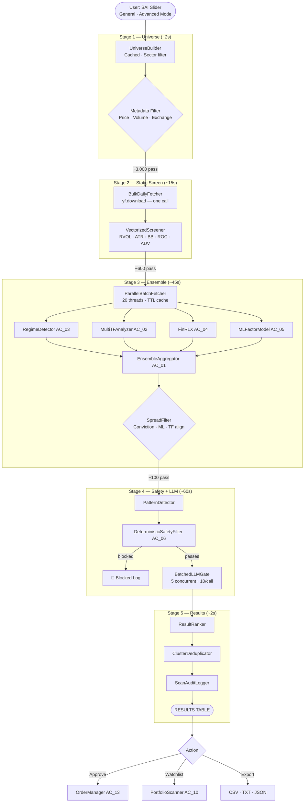

# AlphaChart v3.4 — AC_09: Market-Wide Scanner Mode
**Revision:** v3.4.0 | **Status:** Implementation-Ready | **Owner:** AC_00 §3.2 (Discovery Layer)

---

## Table of Contents
1. [Purpose & Design Philosophy](#1-purpose--design-philosophy)
2. [Pipeline Architecture](#2-pipeline-architecture)
3. [Universe Selection Engine](#3-universe-selection-engine)
4. [Spread Aggressiveness Index (SAI)](#4-spread-aggressiveness-index-sai)
5. [Vectorized Static Screener](#5-vectorized-static-screener)
6. [Parallel Batch Fetcher](#6-parallel-batch-fetcher)
7. [Pattern Recognition Library](#7-pattern-recognition-library)
8. [Batched LLM Gate](#8-batched-llm-gate)
9. [Result Ranking, Clustering & Deduplication](#9-result-ranking-clustering--deduplication)
10. [AI-Assisted Spread Advisor](#10-ai-assisted-spread-advisor)
11. [Preset System](#11-preset-system)
12. [Scan Scheduler](#12-scan-scheduler)
13. [Integration Points](#13-integration-points)
14. [Edge Cases & Resilience](#14-edge-cases--resilience)
15. [Performance Budget](#15-performance-budget)
16. [Non-Negotiable Scanner Constraints](#16-non-negotiable-scanner-constraints)
17. [Success Criteria](#17-success-criteria)

---

## 1. Purpose & Design Philosophy

The Market-Wide Scanner is a proactive discovery engine that surfaces trade setups across thousands of US equities before they appear on any watchlist. It applies the same regime-aware, multi-timeframe ensemble pipeline used by the Portfolio Scanner — with no separate execution path and no relaxed safety constraints.

```
PRINCIPLE 1 — ONE PIPELINE
  Scanner results enter the identical downstream path as portfolio signals.
  DeterministicSafetyFilter, DrawdownGuard, LLM Gate, OrderManager — all identical.

PRINCIPLE 2 — CHEAP LAYERS FIRST
  Static metadata → Vectorized technical screen → Ensemble → Safety → LLM.
  Expensive operations (LLM, FinRL-X) run only on candidates that cleared all cheaper filters.

PRINCIPLE 3 — QUALITY OVER QUANTITY
  A scan returning 15 exceptional setups outperforms 500 borderline ones.
  The SAI slider controls the aperture. Hard limits are always enforced.

PRINCIPLE 4 — SPEED IS ARCHITECTURE
  Full universe scan: < 2.5 min. Incremental rescan: < 30 sec.
  Parallelism and caching are requirements, not optimizations.
```

---

## 2. Pipeline Architecture



**Stage timing budget:** Universe 2s + Screen 15s + Ensemble 45s + Safety+LLM 60s + Results 2s = **< 2.5 min total**

---

## 3. Universe Selection Engine

```python
import json, os, time
from pathlib import Path
import pandas as pd

class UniverseBuilder:
    CACHE_TTL_HOURS      = 24
    META_CACHE_TTL_HOURS = 168  # 7 days

    PREDEFINED_UNIVERSES = {
        "ALL_US_STOCKS":       "Full US equity universe (~8,000–11,000 tickers)",
        "SP500":               "S&P 500 components (~500)",
        "NASDAQ100":           "Nasdaq-100 components (~100)",
        "RUSSELL2000":         "Russell 2000 small-cap (~2,000)",
        "HIGH_LIQUIDITY":      "Avg dollar volume > $5M/day (~1,500)",
        "MID_LARGE_CAP":       "Market cap > $2B (~2,000)",
        "WATCHLIST_PORTFOLIO": "User watchlist + held positions only",
        "SECTOR_CUSTOM":       "User-defined sector/industry subset",
    }

    def __init__(self, broker_connector, user_watchlist: list[str]):
        self.broker    = broker_connector
        self.watchlist = user_watchlist
        self._cache_dir = Path("./cache")
        self._cache_dir.mkdir(exist_ok=True)

    def get_universe(self, mode: str, filters: dict,
                     sector_filter: list[str] = None) -> list[str]:
        if mode == "WATCHLIST_PORTFOLIO":
            tickers = list(set(self.broker.get_portfolio_tickers() + self.watchlist))
            return self._apply_metadata_filter(tickers, filters)
        tickers = self._load_or_fetch(mode)
        if sector_filter:
            tickers = self._filter_by_sector(tickers, sector_filter)
        return self._apply_metadata_filter(tickers, filters)

    def _apply_metadata_filter(self, tickers: list, filters: dict) -> list:
        meta   = self._load_metadata_cache()
        passed = []
        for t in tickers:
            m = meta.get(t, {})
            if m.get("price", 999) < filters.get("min_price", 5):    continue
            if m.get("price", 0) > filters.get("max_price", 500):    continue
            if m.get("avg_volume_20d", 0) < filters.get("min_avg_volume", 300_000): continue
            if filters.get("exclude_otc", True) and \
               m.get("exchange", "") not in ("NYSE", "NASDAQ", "ARCA"):  continue
            passed.append(t)
        return passed

    def _load_or_fetch(self, mode: str) -> list:
        cached = self._read_cache(f"universe_{mode}")
        if cached:
            return cached
        data = self._fetch_by_mode(mode)
        self._write_cache(f"universe_{mode}", data)
        return data

    def _fetch_by_mode(self, mode: str) -> list:
        if mode == "SP500":
            return pd.read_html(
                "https://en.wikipedia.org/wiki/List_of_S%26P_500_companies"
            )[0]["Symbol"].str.replace(".", "-", regex=False).tolist()
        # Default: Alpaca full asset list
        assets = self.broker.api.list_assets(status="active", asset_class="us_equity")
        return [a.symbol for a in assets if a.tradable]

    def _read_cache(self, key: str) -> list | None:
        path = self._cache_dir / f"{key}.json"
        if not path.exists(): return None
        if time.time() - os.path.getmtime(path) > self.CACHE_TTL_HOURS * 3600: return None
        return json.loads(path.read_text())

    def _write_cache(self, key: str, data: list):
        (self._cache_dir / f"{key}.json").write_text(json.dumps(data))

    def _load_metadata_cache(self) -> dict:
        return self._read_cache("ticker_metadata") or {}

    def _filter_by_sector(self, tickers: list, sectors: list) -> list:
        meta = self._load_metadata_cache()
        return [t for t in tickers if meta.get(t, {}).get("sector", "") in sectors]
```

---

## 4. Spread Aggressiveness Index (SAI)

The SAI is a single scalar `[0.0, 1.0]` that simultaneously drives all scanner threshold parameters.

```python
from dataclasses import dataclass

@dataclass
class SpreadConfig:
    min_conviction_score:     float   # [0.58–0.88]
    min_llm_quality_score:    float   # [0.55–0.82]
    min_ml_factor_score:      float   # [0.48–0.75]
    min_rvol:                 float   # [0.9–2.5]
    min_atr_pct:              float   # [0.6–3.0]
    max_bb_width_percentile:  float   # [10–40]
    max_days_since_breakout:  int
    min_adv_usd:              float
    allowed_regimes:          list[str]
    require_anchor_tf_align:  bool
    min_tf_alignment_count:   int
    min_rr_ratio:             float
    sai:                      float
    tier_label:               str
    tier_emoji:               str
    estimated_results_range:  tuple[int, int]
    projected_win_rate_range: tuple[int, int]

def build_spread_config(sai: float,
                         calibrated_win_rates: dict = None) -> SpreadConfig:
    sai = max(0.0, min(1.0, sai))
    def lerp(a, b, t): return round(a + (b-a)*t, 4)
    def lerp_i(a, b, t): return int(round(a + (b-a)*t))

    if sai < 0.33:
        regimes, require_align, min_tf = ["TRENDING_UP"], True, 4
    elif sai < 0.66:
        regimes, require_align, min_tf = ["TRENDING_UP","RANGING"], True, 3
    else:
        regimes, require_align, min_tf = ["TRENDING_UP","TRENDING_DOWN","RANGING","VOLATILE"], False, 2

    tier, emoji = (
        ("Ultra Conservative","🟢") if sai < 0.20 else
        ("Conservative","🟢")       if sai < 0.40 else
        ("Moderate","🟡")           if sai < 0.60 else
        ("Aggressive","🟠")         if sai < 0.80 else
        ("Max Spread","🔴")
    )
    static_wr = (
        (80,90) if sai<0.20 else (72,80) if sai<0.40 else
        (65,72) if sai<0.60 else (58,65) if sai<0.80 else (55,60)
    )
    bin_key = round(sai * 5) / 5
    wr = calibrated_win_rates.get(bin_key,{}).get("win_rate_range", static_wr) \
         if calibrated_win_rates else static_wr

    return SpreadConfig(
        min_conviction_score    = lerp(0.88, 0.58, sai),
        min_llm_quality_score   = lerp(0.82, 0.55, sai),
        min_ml_factor_score     = lerp(0.75, 0.48, sai),
        min_rvol                = lerp(2.5,  0.9,  sai),
        min_atr_pct             = lerp(3.0,  0.6,  sai),
        max_bb_width_percentile = lerp(10.0, 40.0, sai),
        max_days_since_breakout = lerp_i(2, 20, sai),
        min_adv_usd             = lerp(5_000_000, 300_000, sai),
        allowed_regimes         = regimes,
        require_anchor_tf_align = require_align,
        min_tf_alignment_count  = min_tf,
        min_rr_ratio            = lerp(2.5, 1.2, sai),
        sai=sai, tier_label=tier, tier_emoji=emoji,
        estimated_results_range  = (lerp_i(5,50,sai), lerp_i(25,200,sai)),
        projected_win_rate_range = wr,
    )
```

---

## 5. Vectorized Static Screener

Eliminates ~80% of the universe using pandas vectorized operations on the bulk-downloaded panel. This is the single largest performance optimization in the scanner.

```python
import ta, numpy as np

class VectorizedScreener:
    MIN_BARS = 30

    def screen_vectorized(self, panel, tickers: list,
                          sc: SpreadConfig) -> tuple[list, list]:
        passed, blocked = [], []
        for ticker in tickers:
            try:
                df = self._extract(panel, ticker)
                r  = self._screen_one(ticker, df, sc)
                if r["passed"]:
                    passed.append((ticker, df, r["pre_scores"]))
                else:
                    blocked.append({"ticker": ticker, "reason": r["reason"]})
            except Exception as e:
                blocked.append({"ticker": ticker, "reason": f"EXCEPTION:{e}"})
        return passed, blocked

    def _extract(self, panel, ticker: str):
        if isinstance(panel.columns, pd.MultiIndex):
            return panel.xs(ticker, axis=1, level=1).dropna(how="all").copy()
        return panel.copy()

    def _screen_one(self, ticker: str, df, sc: SpreadConfig) -> dict:
        if df is None or len(df) < self.MIN_BARS:
            return {"passed": False, "reason": "INSUFFICIENT_DATA", "pre_scores": {}}
        c, h, l, v = df["Close"], df["High"], df["Low"], df["Volume"]

        avg_vol = v.rolling(20).mean().iloc[-1]
        rvol    = float(v.iloc[-1] / avg_vol) if avg_vol > 0 else 0.0
        if rvol < sc.min_rvol:
            return {"passed": False, "reason": f"LOW_RVOL:{rvol:.2f}", "pre_scores":{}}

        atr_pct = float(ta.volatility.AverageTrueRange(h, l, c).average_true_range().iloc[-1]
                        / c.iloc[-1] * 100)
        if atr_pct < sc.min_atr_pct:
            return {"passed": False, "reason": f"LOW_ATR:{atr_pct:.2f}", "pre_scores":{}}

        adv_usd = float(avg_vol * c.iloc[-1])
        if adv_usd < sc.min_adv_usd:
            return {"passed": False, "reason": f"LOW_ADV:{adv_usd/1e6:.1f}M", "pre_scores":{}}

        bb    = ta.volatility.BollingerBands(c, 20, 2)
        bb_w  = (bb.bollinger_hband() - bb.bollinger_lband()) / c.replace(0, np.nan)
        bb_pc = float(bb_w.rank(pct=True).iloc[-1] * 100) if not bb_w.isna().all() else 50.0

        h252    = h.rolling(min(252,len(h))).max().iloc[-1]
        dist_pc = float((h252 - c.iloc[-1]) / h252) if h252 > 0 else 1.0
        roc_20  = float((c.iloc[-1]/c.iloc[-20]-1)*100) if len(c) > 20 else 0.0
        rsi     = float(ta.momentum.RSIIndicator(c, 14).rsi().iloc[-1])

        return {
            "passed": True, "reason": "PASS",
            "pre_scores": {
                "rvol": round(rvol,3), "atr_pct": round(atr_pct,3),
                "bb_pctile": round(bb_pc,1), "is_squeeze": bb_pc<=sc.max_bb_width_percentile,
                "near_breakout": dist_pc<=0.05, "roc_20": round(roc_20,2),
                "adv_usd": round(adv_usd,0), "rsi_14": round(rsi,1),
            }
        }
```

---

## 6. Parallel Batch Fetcher

```python
from concurrent.futures import ThreadPoolExecutor, as_completed
import threading, time

class ParallelBatchFetcher:
    MAX_WORKERS = 20
    CACHE_TTL   = {"daily": 300, "1wk": 900, "1mo": 3600}

    def __init__(self, data_fetcher):
        self.fetcher = data_fetcher
        self._lock   = threading.Lock()
        self._cache  = {}

    def bulk_download_daily(self, tickers: list, period: str = "3mo"):
        import yfinance as yf
        chunk_size = 500
        chunks     = [tickers[i:i+chunk_size] for i in range(0,len(tickers),chunk_size)]
        frames     = []
        for chunk in chunks:
            frames.append(yf.download(" ".join(chunk), period=period,
                interval="1d", group_by="ticker", auto_adjust=True,
                progress=False, threads=True, timeout=30))
        return pd.concat(frames, axis=1) if len(frames) > 1 else frames[0]

    def fetch_batch_parallel(self, tickers: list, timeframes: list,
                              progress_cb=None) -> dict:
        results, completed = {}, 0
        with ThreadPoolExecutor(max_workers=self.MAX_WORKERS) as ex:
            future_map = {ex.submit(self._fetch_ticker, t, timeframes): t
                          for t in tickers}
            for future in as_completed(future_map):
                ticker = future_map[future]
                try:
                    data = future.result(timeout=15)
                    if data: results[ticker] = data
                except Exception: pass
                completed += 1
                if progress_cb: progress_cb(completed, len(tickers))
        return results

    def _fetch_ticker(self, ticker: str, timeframes: list) -> dict:
        now = time.time()
        with self._lock:
            cached = self._cache.get(ticker, {})
            if all(now - cached.get(f"_ts_{tf}", 0) < self.CACHE_TTL.get(tf, 300)
                   for tf in timeframes):
                return {tf: cached[tf] for tf in timeframes if tf in cached}
        data = {}
        for tf in timeframes:
            try: data[tf] = self.fetcher.fetch(ticker, tf)
            except Exception: data[tf] = None
        with self._lock:
            entry = {**data, **{f"_ts_{tf}": now for tf in timeframes}}
            self._cache[ticker] = entry
        return data
```

---

## 7. Pattern Recognition Library

```python
class PatternDetector:
    PATTERNS = [
        "MOMENTUM_BREAKOUT", "VOLATILITY_COMPRESSION", "CONSOLIDATION_COIL",
        "TREND_CONTINUATION", "MEAN_REVERSION_PULLBACK", "VOLUME_SURGE_REVERSAL",
        "RELATIVE_STRENGTH", "EARNINGS_MOMENTUM",
    ]

    def detect(self, ticker: str, df, contexts: list, pre: dict) -> str:
        c, h, l, v = df["Close"], df["High"], df["Low"], df["Volume"]
        rvol, bb_pc = pre.get("rvol",1.0), pre.get("bb_pctile",50.0)
        is_sq, near_brk = pre.get("is_squeeze",False), pre.get("near_breakout",False)
        roc_20 = pre.get("roc_20", 0.0)

        atr_s    = ta.volatility.AverageTrueRange(h,l,c).average_true_range()
        expanding= float(atr_s.iloc[-1]) > float(atr_s.iloc[-5:].mean()) * 1.05
        ema20    = ta.trend.EMAIndicator(c,20).ema_indicator().iloc[-1]
        ema50    = ta.trend.EMAIndicator(c,50).ema_indicator().iloc[-1]
        above    = c.iloc[-1] > ema20 > ema50
        ema_dist = abs(c.iloc[-1] - ema20) / ema20

        scores = {
            "MOMENTUM_BREAKOUT":      (2.0 if near_brk else 0) + (1.5 if rvol>=1.8 else 0) + (1.0 if expanding else 0),
            "VOLATILITY_COMPRESSION": (2.5 if is_sq else 0) + (1.5 if bb_pc<=12 else 0.5 if bb_pc<=25 else 0),
            "CONSOLIDATION_COIL":     (2.0 if bb_pc<=20 else 0) + (1.5 if not expanding else 0),
            "TREND_CONTINUATION":     (2.0 if above else 0) + (1.5 if ema_dist<0.03 else 0),
            "MEAN_REVERSION_PULLBACK":(2.0 if above and ema_dist<=0.015 else 0) + (1.0 if roc_20>3 else 0),
            "VOLUME_SURGE_REVERSAL":  (2.5 if float(v.iloc[-1]) > float(v.rolling(20).mean().iloc[-1])*3 else 0),
            "RELATIVE_STRENGTH":      (2.0 if roc_20>10 else 0) + (1.0 if rvol>=1.3 else 0),
            "EARNINGS_MOMENTUM":      (2.0 if rvol>3.0 and roc_20>5 else 0),
        }
        best = max(scores, key=scores.get)
        return best if scores[best] >= 2.0 else "UNKNOWN"
```

---

## 8. Batched LLM Gate

```python
import anthropic, json
import concurrent.futures

BATCH_SYSTEM_PROMPT = """
You are a senior quantitative analyst. Evaluate the batch of trade signals below.
For each signal, return a quality assessment — NOT a directional decision.
Return a JSON array with one object per signal, in order received.
Each object: {"ticker":str,"quality_score":float,"recommendation":str,
"risk_flags":list[str],"key_strengths":list[str],"key_weaknesses":list[str],"narrative":str}
recommendation: "APPROVE"|"APPROVE_WITH_CAUTION"|"REJECT"
Return ONLY the JSON array.
"""

class BatchedLLMGate:
    TIMEOUT_SECONDS = 15
    MAX_WORKERS     = 5

    def __init__(self, model: str = "claude-sonnet-4-6"):
        self.client = anthropic.Anthropic()
        self.model  = model

    def evaluate_batch(self, candidates: list, rag_memory, config: dict) -> list:
        if not candidates: return []
        dossier = self._build_batch_dossier(candidates, rag_memory)
        try:
            with concurrent.futures.ThreadPoolExecutor(max_workers=1) as ex:
                raw = ex.submit(self._call, dossier).result(timeout=self.TIMEOUT_SECONDS)
        except Exception:
            return [self._reject(c, "LLM_TIMEOUT") for c in candidates]
        try:
            evals = json.loads(raw)
            if not isinstance(evals, list): evals = [evals]
        except Exception:
            return [self._reject(c, "LLM_PARSE_FAILURE") for c in candidates]

        results = []
        for cand, ev in zip(candidates, evals):
            results.append(self._build_scan_result(cand, ev, config))
        return results

    def _call(self, dossier: str) -> str:
        r = self.client.messages.create(
            model=self.model, max_tokens=2000,
            system=BATCH_SYSTEM_PROMPT,
            messages=[{"role":"user","content":dossier}]
        )
        return r.content[0].text

    def _build_batch_dossier(self, candidates: list, rag_memory) -> str:
        sections = []
        for i, c in enumerate(candidates):
            rag = rag_memory.retrieve_context(c.ticker, c.regime, c.direction)
            tf  = "\n".join([f"  {ctx.timeframe}: {ctx.trend_direction.value} "
                             f"s={ctx.trend_strength:.2f} m={ctx.momentum_score:+.2f}"
                             for ctx in sorted(c.contexts, key=lambda x: x.confidence, reverse=True)])
            sections.append(f"=== SIGNAL {i+1}: {c.ticker} ===\n"
                            f"Direction: {c.direction.value} | Regime: {c.regime.value}\n"
                            f"Conviction: {c.conviction:.3f} | ML: {c.ml_score:.3f}\n"
                            f"Pattern: {c.pattern} | RVOL: {c.pre_scores.get('rvol',0):.2f}x\n"
                            f"FinRL-X: {c.frl_out.action_probs} | Conf: {c.frl_out.agent_confidence:.3f}\n"
                            f"Timeframes:\n{tf}\n"
                            f"RAG:\n{rag[:400] if rag else 'No history.'}")
        return "Evaluate:\n" + "\n\n".join(sections)

    def _reject(self, cand, reason: str):
        # Returns a ScanResult-like dict with zero quality for upstream handling
        return {"ticker": cand.ticker, "quality_score": 0.0,
                "recommendation": "REJECT", "risk_flags": [reason],
                "key_strengths": [], "key_weaknesses": [reason],
                "narrative": f"Rejected: {reason}"}
```

---

## 9. Result Ranking, Clustering & Deduplication

```python
class ResultRanker:
    DEFAULT_WEIGHTS = {"conviction":0.35,"quality":0.30,"rr":0.20,"rvol":0.10,"adv":0.05}

    @staticmethod
    def rank(results: list, config: dict) -> list:
        w = config.get("rank_weights", ResultRanker.DEFAULT_WEIGHTS)
        for r in results:
            r.rank_score = round(
                w["conviction"] * r.conviction_score +
                w["quality"]    * r.quality_score    +
                w["rr"]         * min(r.rr_ratio / 5.0, 1.0) +
                w["rvol"]       * min(r.pre_scores.get("rvol",1) / 5.0, 1.0) +
                w["adv"]        * min(r.pre_scores.get("adv_usd",0) / 50_000_000, 1.0),
            4)
        return sorted(results, key=lambda x: x.rank_score, reverse=True)

class ClusterDeduplicator:
    """Groups correlated signals (same pattern+regime+direction or same sector+direction)."""
    @staticmethod
    def cluster(results: list, meta_cache: dict = None) -> list:
        meta, assigned, counter = meta_cache or {}, {}, 0
        for i, r in enumerate(results):
            if r.ticker in assigned: continue
            cid = f"C{counter:03d}"
            assigned[r.ticker] = r.cluster_id = cid
            r_sector = meta.get(r.ticker, {}).get("sector", "")
            for j, other in enumerate(results):
                if j <= i or other.ticker in assigned: continue
                o_sector = meta.get(other.ticker, {}).get("sector", "")
                if ((other.pattern==r.pattern and other.regime==r.regime and other.direction==r.direction) or
                    (o_sector==r_sector and r_sector and other.direction==r.direction)):
                    assigned[other.ticker] = other.cluster_id = cid
            counter += 1
        return results
```

---

## 10. AI-Assisted Spread Advisor

```python
class SpreadAdvisor:
    """Rule-based SAI recommendation using market conditions + user history."""

    def recommend(self, regime_distribution: dict, recent_win_rate: float,
                  recent_trade_count: int, calibrated_win_rates: dict,
                  vix_level: float = None) -> dict:
        sai, reasons, confidence = 0.45, [], "MEDIUM"

        pct_up  = regime_distribution.get("TRENDING_UP", 0)
        pct_vol = regime_distribution.get("VOLATILE", 0)

        if pct_vol > 0.30:
            sai -= 0.15; reasons.append(f"High volatility regime ({pct_vol:.0%})")
        if pct_up > 0.60:
            sai -= 0.08; reasons.append(f"Strong trending conditions — be selective")
        if vix_level and vix_level > 30:
            sai -= 0.12; reasons.append(f"VIX={vix_level:.1f} elevated")

        if recent_trade_count >= 10:
            confidence = "HIGH"
            if recent_win_rate < 0.55:
                sai -= 0.10; reasons.append(f"Recent win rate {recent_win_rate:.0%} — tighten")
            elif recent_win_rate > 0.75:
                sai += 0.05; reasons.append(f"System performing well — moderate broadening OK")

        sai = round(max(0.05, min(0.95, sai)), 2)
        return {
            "recommended_sai": sai,
            "rationale":       " · ".join(reasons) or "Default moderate — no strong signal.",
            "confidence":      confidence,
        }
```

---

## 11. Preset System

Built-in presets stored as JSON in `./presets/`:

| Preset | SAI | Min Conv | Min RVOL | Regimes |
|---|---|---|---|---|
| Momentum Breakout | 0.28 | 0.80 | 2.0× | TRENDING_UP only |
| Volatility Compression | 0.60 | 0.65 | 0.8× | TRENDING_UP + RANGING |
| Mean Reversion Pullback | 0.45 | 0.70 | 1.0× | TRENDING_UP + RANGING |
| High Conviction Only | 0.12 | 0.88 | 1.8× | TRENDING_UP only |

---

## 12. Scan Scheduler

```python
import schedule, threading, time

class ScanScheduler:
    INTERVALS = {
        "ON_DEMAND":None, "EVERY_5_MIN":5, "EVERY_15_MIN":15,
        "EVERY_30_MIN":30, "EVERY_60_MIN":60,
        "PRE_MARKET":"09:00", "MARKET_OPEN":"09:30", "MIDDAY":"12:00",
    }
    def __init__(self, scanner): self.scanner=scanner; self._running=False
    def start(self, mode: str, kwargs: dict):
        self._running = True
        threading.Thread(target=self._loop, args=(mode,kwargs), daemon=True).start()
    def stop(self): self._running = False
    def _loop(self, mode, kwargs):
        iv = self.INTERVALS.get(mode)
        if iv is None: return
        if isinstance(iv, int): schedule.every(iv).minutes.do(self.scanner.run_scan, **kwargs)
        else: schedule.every().day.at(iv).do(self.scanner.run_scan, **kwargs)
        while self._running: schedule.run_pending(); time.sleep(10)
```

---

## 13. Integration Points

| Module | Direction | Data Exchanged |
|---|---|---|
| AC_01 (Ensemble) | Called by Scanner | conviction, direction |
| AC_02 (MTA) | Called by Scanner | list[TimeframeContext] |
| AC_03 (Regime) | Called by Scanner | Regime, weights |
| AC_04 (FinRL-X) | Called by Scanner | FinRLXOutput |
| AC_05 (ML Factor) | Called by Scanner | ml_factor_score |
| AC_06 (Safety) | → Scanner | Blocks candidates pre-LLM |
| AC_07 (LLM) | Called by Scanner | BatchedLLMGate |
| AC_10 (Portfolio) | ← Scanner | Approved results → Add to watchlist |
| AC_11 (GUI) | ← Scanner | Results table, charts, heatmap |
| AC_12 (RAG) | Called by Scanner | retrieve_context per candidate |
| AC_13 (Orders) | ← Scanner | Approved ScanResults → execute |

**Critical:** Scanner results approved via GUI call `ScanToSignalBridge.approve_and_queue()`, which runs the same `DrawdownGuard → StateLock → OrderManager` path as portfolio signals. Scanner results never bypass execution safety.

---

## 14. Edge Cases & Resilience

| Case | Handling |
|---|---|
| Market open blackout (9:30–9:45 ET) | Results shown; Approve buttons disabled |
| Market holiday | Scanner disabled; banner shown |
| > 20% of universe fails to fetch | `DATA_QUALITY_WARNING` banner |
| LLM batch timeout | All candidates in batch rejected |
| Earnings within ±2 days | Blocked pre-ensemble (saves compute) |
| Stale data (> 30 min old) | `STALE_DATA` rejection |
| DrawdownGuard soft/hard halt | Scanner runs but all approve actions disabled |
| Cluster with 3+ members | Concentration alert banner shown |

---

## 15. Performance Budget

| Stage | Target | Strategy |
|---|---|---|
| Universe build | < 2s | 24h JSON cache |
| Metadata filter | < 1s | In-memory dict |
| Bulk daily fetch | < 12s | Single yf.download() call, chunked 500 |
| Vectorized screen | < 5s | Pandas vectorized; no Python per-ticker loops |
| Multi-TF fetch | < 40s | 20-thread pool + TTL cache |
| Ensemble scoring | < 30s | Batched state vectors; FinRL-X GPU optional |
| Safety filter | < 1s | In-memory rules |
| LLM gate (100 candidates) | < 55s | 5 concurrent × 10/batch |
| Rank + cluster | < 1s | In-memory sort |
| **Total** | **< 2.5 min** | |

---

## 16. Non-Negotiable Scanner Constraints

```
SNC-01  All v3.4 hard safety limits apply to scanner results — no relaxation
SNC-02  Market open blackout: results visible, execution disabled until 9:45 ET
SNC-03  Earnings blackout (±2 days): blocked pre-ensemble
SNC-04  LLM batch timeout → all affected candidates rejected; no fallback
SNC-05  DrawdownGuard halt → approve/auto-approve disabled
SNC-06  Stale data (> 30 min) → ticker blocked as STALE_DATA
SNC-07  SAI win-rate projections recalibrated every 30 days from trade log
SNC-08  Auto-approve: hard cap N ≤ 10; explicit user button press required
SNC-09  Scan results are session-only; export to persist
SNC-10  Scanner state (running/paused/error) always visible in GUI
SNC-11  Data quality warning if > 20% of universe fails to fetch
SNC-12  Cluster concentration alerts shown when ≥ 3 correlated results
SNC-13  SpreadAdvisor recommendations are advisory only; never auto-applied
SNC-14  All scan runs logged to audit trail
SNC-15  Scanner disabled if broker DISCONNECTED
```

---

## 17. Success Criteria

| Metric | Minimum | Target |
|---|---|---|
| Full universe scan time | < 5 min | < 2.5 min |
| Results at SAI=0.45 | 15–50 | 25–45 |
| Scanner-originated win rate | ≥ 60% | ≥ 72% |
| Rank score → win rate correlation | r ≥ 0.30 | r ≥ 0.50 |
| Static screen false-negative rate | < 10% | < 5% |
| LLM batch timeout rate | < 2% | < 0.5% |

---
---

# AlphaChart v3.4 — AC_10: Portfolio Scanner & Live Broker Integration
**Revision:** v3.4.0 | **Status:** Implementation-Ready | **Owner:** AC_00 §3.2 (Discovery Layer)

---

## Table of Contents
1. [Purpose](#1-purpose)
2. [Broker Connectors](#2-broker-connectors)
3. [PortfolioScanner](#3-portfolioscanner)
4. [Signal Prioritization](#4-signal-prioritization)
5. [BrokerConnector Abstraction](#5-brokerconnector-abstraction)
6. [Integration Points](#6-integration-points)
7. [Edge Cases](#7-edge-cases)
8. [Success Criteria](#8-success-criteria)

---

## 1. Purpose

The Portfolio Scanner continuously monitors held positions and watchlist tickers for emerging signals using the full AlphaChart signal pipeline. Unlike the Market-Wide Scanner, it operates on a focused universe (typically 10–100 tickers) and runs on a configurable schedule (default: every 15 minutes).

---

## 2. Broker Connectors

### 2.1 Alpaca (Primary)

```python
import alpaca_trade_api as tradeapi

class AlpacaConnector:
    def __init__(self, api_key: str, secret_key: str, base_url: str):
        self.api = tradeapi.REST(api_key, secret_key, base_url)

    def get_portfolio_tickers(self) -> list[str]:
        return [p.symbol for p in self.api.list_positions()]

    def get_account_equity(self) -> float:
        return float(self.api.get_account().equity)

    def submit_paper_order(self, symbol: str, qty: int, side: str,
                           order_type: str = "limit", time_in_force: str = "day",
                           limit_price: float = None):
        return self.api.submit_order(
            symbol=symbol, qty=qty, side=side,
            type=order_type, time_in_force=time_in_force,
            limit_price=limit_price
        )

    def get_open_orders(self) -> list:
        return self.api.list_orders(status="open")

    def cancel_order(self, order_id: str):
        self.api.cancel_order(order_id)

    def get_position(self, ticker: str):
        try: return self.api.get_position(ticker)
        except Exception: return None
```

### 2.2 IBKR (Fallback)

```python
from ib_insync import IB, Stock, LimitOrder, MarketOrder

class IBKRConnector:
    def __init__(self, host="127.0.0.1", port=7497, client_id=1):
        self.ib = IB()
        self.ib.connect(host, port, clientId=client_id)

    def get_portfolio_tickers(self) -> list[str]:
        return [p.contract.symbol for p in self.ib.positions()]

    def get_account_equity(self) -> float:
        vals = self.ib.accountValues()
        for v in vals:
            if v.tag == "NetLiquidation" and v.currency == "USD":
                return float(v.value)
        return 0.0

    def submit_paper_order(self, symbol: str, qty: int, side: str,
                           limit_price: float = None):
        contract = Stock(symbol, "SMART", "USD")
        order    = (LimitOrder(side.upper(), qty, limit_price)
                    if limit_price else MarketOrder(side.upper(), qty))
        return self.ib.placeOrder(contract, order)
```

---

## 3. PortfolioScanner

```python
import schedule, time, threading

class PortfolioScanner:
    def __init__(self, broker_connector, watchlist: list[str],
                 scan_interval_minutes: int = 15):
        self.broker         = broker_connector
        self.watchlist      = watchlist
        self.scan_interval  = scan_interval_minutes
        self.signal_queue   = []
        self._running       = False

    def get_scan_universe(self) -> list[str]:
        held = self.broker.get_portfolio_tickers()
        return sorted(set(held + self.watchlist))

    def run_scan_cycle(self, signal_pipeline) -> list:
        universe = self.get_scan_universe()
        signals  = []
        for ticker in universe:
            try:
                sig = signal_pipeline.generate_signal(ticker)
                if sig: signals.append(sig)
            except Exception as e:
                pass  # isolated per-ticker failure
        self.signal_queue = sorted(signals,
            key=lambda x: x.conviction_score, reverse=True)
        return self.signal_queue

    def start_schedule(self, signal_pipeline):
        self._running = True
        def _loop():
            schedule.every(self.scan_interval).minutes.do(
                self.run_scan_cycle, signal_pipeline)
            while self._running:
                schedule.run_pending(); time.sleep(30)
        threading.Thread(target=_loop, daemon=True).start()

    def stop(self): self._running = False
```

---

## 4. Signal Prioritization

After each scan cycle, signals are ranked by conviction score and filtered by the active quality threshold from config. Results are presented in the Signals tab:

| Rank | Ticker | Dir | TF | Conv | Qual | Regime | Action |
|---|---|---|---|---|---|---|---|
| 1 | NVDA | LONG | Daily | 0.87 | 0.82 | TRENDING_UP | [Approve] |
| 2 | AAPL | SHORT | Daily | 0.73 | 0.71 | RANGING | [Approve] |

Signals below threshold are shown in a collapsed "Below Threshold" panel for transparency.

---

## 5. BrokerConnector Abstraction

```python
from abc import ABC, abstractmethod

class BrokerConnector(ABC):
    """
    Abstract base class for all broker connectors.
    Both AlpacaConnector and IBKRConnector implement this interface.
    All OrderManager calls use this interface — never concrete classes directly.
    """
    @abstractmethod
    def get_portfolio_tickers(self) -> list[str]: ...
    @abstractmethod
    def get_account_equity(self) -> float: ...
    @abstractmethod
    def submit_paper_order(self, symbol, qty, side, **kwargs): ...
    @abstractmethod
    def get_open_orders(self) -> list: ...
    @abstractmethod
    def cancel_order(self, order_id: str): ...

def create_broker_connector(config: dict) -> BrokerConnector:
    """Factory function — returns correct connector based on config."""
    broker_type = config.get("paper_broker", "ALPACA").upper()
    if broker_type == "ALPACA":
        return AlpacaConnector(
            config["alpaca_api_key"],
            config["alpaca_secret_key"],
            config.get("alpaca_base_url", "https://paper-api.alpaca.markets")
        )
    elif broker_type == "IBKR":
        return IBKRConnector(
            config.get("ibkr_host", "127.0.0.1"),
            config.get("ibkr_port", 7497),
            config.get("ibkr_client_id", 1),
        )
    raise ValueError(f"Unknown broker: {broker_type}")
```

---

## 6. Integration Points

| Module | Direction | Data |
|---|---|---|
| AC_09 (Scanner) | ← Portfolio | Watchlist additions from scanner |
| AC_11 (GUI) | ← Portfolio | Signal queue → Signals tab |
| AC_13 (Orders) | → Portfolio | Approved signals → broker |
| AC_06 (Safety) | → Portfolio | DrawdownGuard uses broker equity |
| AC_08 (Sizer) | → Portfolio | Position size uses broker equity |

---

## 7. Edge Cases

| Case | Handling |
|---|---|
| Broker API timeout | Retry 3× with exponential backoff; then halt scan cycle |
| No positions held | Universe = watchlist only |
| Empty watchlist and no positions | Universe = []; scan skipped with warning |
| IBKR not running (TWS/Gateway offline) | Connection fails; auto-fallback message shown |
| Alpaca rate limit | 429 response triggers 60s backoff |
| Scan cycle takes > scan_interval | Next cycle starts only after current completes |

---

## 8. Success Criteria

| Metric | Target |
|---|---|
| Portfolio scan latency (30 tickers) | < 45s |
| Broker API connection uptime | > 99.5% |
| Signal generation error isolation | 100% |
| Watchlist persistence across restarts | 100% |

---
---

# AlphaChart v3.4 — AC_11: BIOS-Style GUI & User Configuration System
**Revision:** v3.4.0 | **Status:** Implementation-Ready | **Owner:** AC_00 §3 (Interface Layer)

---

## Table of Contents
1. [Design Philosophy](#1-design-philosophy)
2. [Configuration Architecture](#2-configuration-architecture)
3. [General Mode — Controls & Layout](#3-general-mode--controls--layout)
4. [Advanced Mode — Controls](#4-advanced-mode--controls)
5. [Aggressiveness Index Mapping](#5-aggressiveness-index-mapping)
6. [Dashboard Tab](#6-dashboard-tab)
7. [Signals Tab](#7-signals-tab)
8. [Portfolio Tab](#8-portfolio-tab)
9. [Performance Tab](#9-performance-tab)
10. [Learning Stats Tab](#10-learning-stats-tab)
11. [Configuration Tab](#11-configuration-tab)
12. [CSS & Visual Design](#12-css--visual-design)
13. [Integration Points](#13-integration-points)
14. [Success Criteria](#14-success-criteria)

---

## 1. Design Philosophy

The GUI is modeled on computer BIOS architecture:
- **General Mode (Easy):** Single growth target slider. All other settings computed automatically. Zero friction for new users.
- **Advanced Mode:** Full parameter exposure across all subsystems. Expert-level tuning without requiring code changes.

Switching modes never resets unsaved configuration. The two modes share the same underlying `config` dict — Advanced Mode simply exposes the values that General Mode computes automatically.

---

## 2. Configuration Architecture

```python
class ConfigManager:
    """
    Single source of truth for runtime configuration.
    All modules receive config from ConfigManager.
    ConfigManager enforces hard limits after every update.
    """
    def __init__(self, safety_module, agg_mapper):
        self.safety = safety_module
        self.mapper = agg_mapper
        self._config = self._default_config()

    def _default_config(self) -> dict:
        return {
            # Growth Target (General Mode)
            "starting_equity":       10_000.0,
            "target_equity":         100_000.0,
            "aggressiveness_index":  0.65,       # computed from target
            # Risk
            "max_drawdown_tolerance":0.15,
            "max_single_trade_risk": 0.03,
            "auto_trade":            False,
            "scan_interval":         15,
            "paper_broker":          "ALPACA",
            # Signal thresholds (AI-modulated)
            "conviction_threshold":  0.70,
            "min_quality_score":     0.65,
            "position_size_pct":     0.03,
            "stop_loss_atr_mult":    2.0,
            "profit_target_rr":      2.0,
            "max_concurrent_trades": 6,
            # Learning
            "rag_decay_half_life_days": 90,
            "rlmf_reward_scale":        1.0,
            "cross_ticker_weight":      0.30,
            "per_ticker_weight":        0.70,
        }

    def update_from_growth_target(self, starting: float, target: float):
        ai = self.mapper.compute_ai(starting, target)
        self._config["starting_equity"]      = starting
        self._config["target_equity"]        = target
        self._config["aggressiveness_index"] = ai
        self._config = self.mapper.apply(ai, self._config)
        self.safety.validate_hard_limits(self._config)
        return self._config

    def get(self) -> dict:
        return dict(self._config)

    def update_key(self, key: str, value):
        self._config[key] = value
        self.safety.validate_hard_limits(self._config)
```

---

## 3. General Mode — Controls & Layout

```
┌─────────────────────────────────────────────────────────────────────┐
│  SIDEBAR                                │  MAIN PANEL               │
│  ─────────────────────────────          │  [Tabs]                   │
│  💹 ALPHACHART v3.4                     │                           │
│  ● CONNECTED · Alpaca Paper             │                           │
│  ─────────────────────────────          │                           │
│  📊 ANNUAL GROWTH TARGET                │                           │
│  $10k ────────────[●]──── $1M           │                           │
│  Target: $100,000/yr                    │                           │
│  Tier: 🟠 Aggressive (AI=0.72)          │                           │
│  Monthly: ~21%  Win Rate: ~62%          │                           │
│  ─────────────────────────────          │                           │
│  Max Drawdown: [15%]                    │                           │
│  Trade Risk:   [3%]                     │                           │
│  Auto-Trade:   [OFF]                    │                           │
│  Scan Every:   [15 min]                 │                           │
│  Broker:       [Alpaca ▼]               │                           │
│  Watchlist:    [text input + CSV]       │                           │
│  ─────────────────────────────          │                           │
│  ⚡ General  /  🔧 Advanced             │                           │
│  ─────────────────────────────          │                           │
│  [▶ Start Scan]                         │                           │
│  [🔴 Emergency Stop]                    │                           │
└─────────────────────────────────────────┴───────────────────────────┘
```

```python
def render_general_mode(config_mgr: ConfigManager) -> dict:
    st.markdown("### 📊 Annual Growth Target")

    col_s, col_t = st.columns(2)
    starting = col_s.number_input("Starting Capital ($)", 1000.0, 10_000_000.0,
                                   10_000.0, 1000.0)
    target_options = [20_000, 30_000, 50_000, 75_000, 100_000,
                      150_000, 250_000, 500_000, 750_000, 1_000_000]
    target = col_t.select_slider("Target ($)",
                                   options=target_options,
                                   value=100_000,
                                   format_func=lambda x: f"${x:,}")

    cfg = config_mgr.update_from_growth_target(starting, target)
    ai  = cfg["aggressiveness_index"]

    tier, emoji = _ai_tier_label(ai)
    monthly_ret  = ((target / starting) ** (1/12) - 1) * 100
    implied_wr   = 50 + ai * 20   # rough heuristic for display

    c1, c2, c3 = st.columns(3)
    c1.metric("Tier",        f"{emoji} {tier}")
    c2.metric("Monthly Ret", f"~{monthly_ret:.0f}%")
    c3.metric("Win Rate Needed", f"~{implied_wr:.0f}%")

    if ai > 0.80:
        st.error("⚠️ MAX AGGRESSIVENESS — High risk of significant loss. "
                 "Hard safety limits still apply.")

    st.markdown("---")
    cfg["max_drawdown_tolerance"] = st.slider("Max Drawdown", 0.05, 0.20, 0.15, 0.01,
                                              format="%d%%")
    cfg["max_single_trade_risk"]  = st.slider("Max Trade Risk", 0.01, 0.05, 0.03, 0.005,
                                              format="%.1f%%")
    cfg["auto_trade"]             = st.toggle("Auto-Execute (no approval)", value=False)
    cfg["scan_interval"]          = st.slider("Scan Interval (min)", 1, 60, 15)
    return cfg

def _ai_tier_label(ai: float) -> tuple[str, str]:
    if ai < 0.25: return "Conservative", "🟢"
    if ai < 0.55: return "Moderate",     "🟡"
    if ai < 0.80: return "Aggressive",   "🟠"
    return "Max",           "🔴"
```

---

## 4. Advanced Mode — Controls

```python
def render_advanced_mode(cfg: dict) -> dict:
    st.markdown("### 🎛 Advanced Configuration")

    with st.expander("🎯 Signal Thresholds", expanded=True):
        cfg["conviction_threshold"] = st.slider("Min Conviction",     0.50, 0.95, cfg.get("conviction_threshold", 0.70), 0.01)
        cfg["min_quality_score"]    = st.slider("Min LLM Quality",    0.50, 0.95, cfg.get("min_quality_score", 0.65), 0.01)
        cfg["max_concurrent_trades"]= st.slider("Max Concurrent",     1, 15, cfg.get("max_concurrent_trades", 6))

    with st.expander("🤖 Ensemble Weights"):
        keys = ["finrl_x", "multi_tf_trend", "regime_detector", "ml_factor_model"]
        labels = ["FinRL-X", "Multi-TF Trend", "Regime Detector", "ML Factor"]
        for k, label in zip(keys, labels):
            cfg[f"weight_{k}"] = st.slider(label, 0.0, 1.0, 0.25, 0.05)
        st.caption("Weights are L1-normalized at runtime.")

    with st.expander("⏱ Timeframe Priorities"):
        for tf in ["3mo","1mo","2wk","1wk","daily","intraday"]:
            cfg[f"tf_weight_{tf}"] = st.slider(tf, 0.0, 1.0, 0.70, 0.05)

    with st.expander("🧠 Learning Parameters"):
        cfg["rag_decay_half_life_days"] = st.slider("RAG Decay Half-Life (days)", 7, 365, 90)
        cfg["rlmf_reward_scale"]        = st.slider("RLMF Reward Scale", 0.1, 5.0, 1.0, 0.1)
        cfg["cross_ticker_weight"]      = st.slider("Cross-Ticker Weight", 0.0, 1.0, 0.30, 0.05)

    with st.expander("🤖 FinRL-X Agent"):
        cfg["ppo_learning_rate"]        = st.number_input("PPO Learning Rate", value=3e-4, format="%.6f")
        cfg["training_window_days"]     = st.slider("Training Window (days)", 30, 730, 252)
        cfg["retrain_trigger_drawdown"] = st.slider("Retrain Trigger Drawdown", 0.05, 0.30, 0.10, 0.01)

    with st.expander("📊 Risk Parameters"):
        cfg["stop_loss_atr_mult"] = st.slider("Stop ATR Multiplier", 1.0, 4.0, 2.0, 0.1)
        cfg["profit_target_rr"]   = st.slider("Profit Target R:R",   1.0, 5.0, 2.0, 0.1)

    return cfg
```

---

## 5. Aggressiveness Index Mapping

See AC_08 for the complete `apply_aggressiveness()` implementation. The GUI computes AI from the Growth Target Slider and passes it to `ConfigManager.update_from_growth_target()`.

| Growth Target (from $10k) | AI | Tier |
|---|---|---|
| $20k–$30k (2–3×) | 0.15–0.24 | Conservative |
| $40k–$60k (4–6×) | 0.30–0.39 | Moderate |
| $70k–$100k (7–10×) | 0.42–0.50 | Aggressive |
| $150k–$1M (15–100×) | 0.59–1.00 | Max |

---

## 6. Dashboard Tab

```python
def render_dashboard(signals: list, trade_log: list, cfg: dict,
                     guard, rag_memory):
    st.markdown("## 📊 Dashboard")
    e1,e2,e3,e4 = st.columns(4)
    equity = guard.broker.get_account_equity()
    dd     = guard.get_current_drawdown()
    wins   = sum(1 for t in trade_log if t.get("won"))
    wr     = wins / max(len(trade_log),1)
    e1.metric("Portfolio",  f"${equity:,.0f}")
    e2.metric("Win Rate",   f"{wr:.1%}")
    e3.metric("Drawdown",   f"-{dd:.1%}", delta_color="inverse")
    e4.metric("New Signals",str(len(signals)))

    st.markdown("### Recent Signals")
    for sig in signals[:5]:
        col = st.columns([2,1,1,1,1,2])
        col[0].write(f"**{sig.ticker}**")
        col[1].write(sig.direction.value)
        col[2].write(f"{sig.conviction_score:.0%}")
        col[3].write(f"{sig.quality_score:.0%}")
        col[4].write(sig.regime.value)
        col[5].button("Approve", key=f"dash_ap_{sig.ticker}")
```

---

## 7. Signals Tab

Full signal table with sortable, filterable, expandable rows. See AC_09 §11 for the scanner results table (same visual language). Portfolio signal table uses identical card structure with:
- Conviction + quality metrics
- Multi-TF alignment table
- LLM narrative + strengths/weaknesses
- Entry / stop / target / position size
- Approve / Reject / Watchlist buttons

---

## 8. Portfolio Tab

```python
def render_portfolio_tab(broker, trade_log: list, guard):
    st.markdown("## 📁 Open Positions")
    positions = broker.get_portfolio_tickers()
    if not positions:
        st.info("No open positions.")
        return
    for ticker in positions:
        pos = broker.get_position(ticker)
        if pos:
            c1,c2,c3,c4 = st.columns(4)
            c1.metric(ticker, f"${float(pos.market_value):,.0f}")
            c2.metric("Unrealized P&L", f"${float(pos.unrealized_pl):,.0f}")
            c3.metric("Qty", pos.qty)
            c4.metric("Avg Cost", f"${float(pos.avg_entry_price):.2f}")
    st.markdown(f"**Portfolio Status:** {guard.update_and_check()[1]}")
```

---

## 9. Performance Tab

```python
def render_performance_tab(trade_log: list):
    import plotly.graph_objects as go
    import plotly.express as px

    if not trade_log:
        st.info("No completed trades yet."); return

    wins  = sum(1 for t in trade_log if t.get("won"))
    total = len(trade_log)
    wr    = wins / total
    pnls  = [t.get("pnl_pct",0) for t in trade_log]
    avg_w = sum(p for p in pnls if p>0) / max(wins,1)
    avg_l = sum(p for p in pnls if p<=0) / max(total-wins,1)
    pf    = abs(avg_w * wins / (avg_l * (total-wins) + 1e-9))

    cols = st.columns(5)
    cols[0].metric("Trades", total)
    cols[1].metric("Win Rate", f"{wr:.1%}")
    cols[2].metric("Avg Win", f"{avg_w:.2%}")
    cols[3].metric("Avg Loss", f"{avg_l:.2%}")
    cols[4].metric("Profit Factor", f"{pf:.2f}")

    # Equity curve
    eq, curve = 1.0, []
    for t in trade_log:
        eq *= (1 + t.get("pnl_pct", 0)); curve.append(eq)
    fig = go.Figure(go.Scatter(y=curve, mode="lines", line=dict(color="#3fb950",width=2)))
    fig.update_layout(title="Equity Curve", template="plotly_dark",
                      paper_bgcolor="rgba(0,0,0,0)", plot_bgcolor="rgba(0,0,0,0)")
    st.plotly_chart(fig, use_container_width=True)
```

---

## 10. Learning Stats Tab

```python
def render_learning_tab(rag_memory, retrain_ctrl, trade_log: list):
    st.markdown("## 🧠 Learning & Adaptation")
    wr_by_ticker = {}
    for t in trade_log:
        tk = t.get("ticker","?")
        wr_by_ticker.setdefault(tk, {"wins":0,"total":0})
        wr_by_ticker[tk]["total"] += 1
        if t.get("won"): wr_by_ticker[tk]["wins"] += 1

    if wr_by_ticker:
        import plotly.express as px
        df = pd.DataFrame([
            {"Ticker": tk, "Win Rate": d["wins"]/max(d["total"],1), "Trades": d["total"]}
            for tk, d in sorted(wr_by_ticker.items(), key=lambda x: x[1]["total"], reverse=True)[:10]
        ])
        fig = px.bar(df, x="Ticker", y="Win Rate", color="Trades",
                     title="Per-Ticker Win Rate (Top 10)", template="plotly_dark")
        st.plotly_chart(fig, use_container_width=True)

    should_retrain, reason = retrain_ctrl.should_retrain()
    st.metric("Retrain Status", "⚠️ NEEDED" if should_retrain else "✅ OK",
              delta=reason)
    st.metric("Memory Entries", rag_memory.collection.count())
```

---

## 11. Configuration Tab

```python
def render_config_tab(config_mgr: ConfigManager) -> dict:
    mode = st.radio("Mode", ["⚡ General", "🔧 Advanced"], horizontal=True)
    st.divider()
    if "General" in mode:
        return render_general_mode(config_mgr)
    else:
        return render_advanced_mode(config_mgr.get())
```

---

## 12. CSS & Visual Design

```python
DARK_CSS = """<style>
    .main { background:#0d1117; }
    .block-container { padding-top:1.5rem; }
    .stMetric { background:#161b22; border:1px solid #21262d;
                border-radius:8px; padding:12px; }
    .stMetric label { color:#8b949e; font-size:11px; }
    div[data-testid="stSidebarContent"] { background:#161b22; }
    .tag-long  { background:#0d4429; color:#3fb950; padding:2px 8px;
                 border-radius:4px; font-size:11px; font-weight:700; }
    .tag-short { background:#4d1919; color:#f85149; padding:2px 8px;
                 border-radius:4px; font-size:11px; font-weight:700; }
</style>"""
```

---

## 13. Integration Points

| Module | Direction | Data |
|---|---|---|
| AC_08 (Risk) | ← GUI | `aggressiveness_index` from growth target |
| AC_09 (Scanner) | ← GUI | SAI from scanner tab |
| AC_10 (Portfolio) | ← GUI | Watchlist, scan interval |
| AC_11 → All | → Config | `config` dict passed to all modules |
| AC_12 (Learning) | → GUI | Learning stats data |
| AC_13 (Orders) | ← GUI | Approve/reject actions |

---

## 14. Success Criteria

| Metric | Target |
|---|---|
| GUI startup time | < 3s |
| Config change reflects in signals within next scan | 100% |
| Emergency stop halts all pending orders | < 2s |
| General → Advanced mode switch: no config loss | 100% |
| Growth target slider → AI → all thresholds: consistent | 100% |
